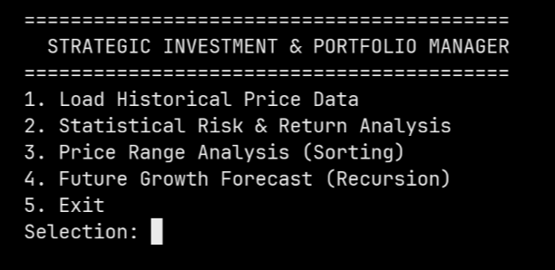
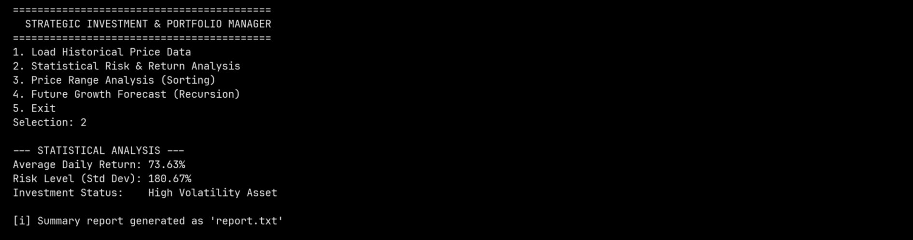
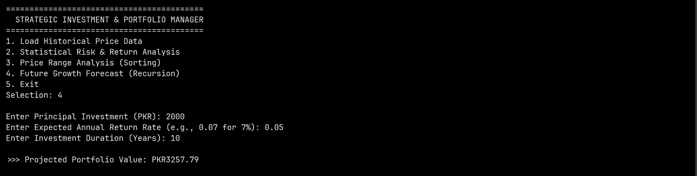

<div align="center">

# Strategic Investment & Portfolio Manager


A console-based investment analysis system written in **C** that evaluates portfolio risk, analyzes historical price data, and forecasts future growth — combining core programming fundamentals with real financial logic.



</div>

---

## Overview

**SIPM** (Strategic Investment & Portfolio Manager) simulates real-world investment evaluation through a menu-driven CLI. It loads historical price data from a file, runs statistical analysis, identifies price trends, and projects compound growth using recursion — all without any external dependencies.

---

## Features

| Feature | Description |
|---|---|
| Statistical Risk Analysis | Calculates mean return, variance, and standard deviation |
| Asset Classification | Labels assets as Conservative, Balanced, or High Volatility |
| Price Range Analysis | Sorts prices via Bubble Sort, identifies min/max and spread |
| Growth Forecasting | Recursive compound interest projection over N years |
| Report Generation | Auto-saves analysis summary to `report.txt` |
| Input Validation | Handles non-numeric and invalid inputs gracefully |

---

## Screenshots

**1. Load Historical Price Data**


**2. Statistical Risk & Return Analysis**


**3. Price Range Analysis**


**4. Future Growth Forecast**


**5. Exit**


---

## Getting Started

### Prerequisites

- GCC compiler
- A `prices.txt` file with space-separated daily prices

### Setup

**1. Clone the repository**
```bash
git clone https://github.com/muhammadwali0/Strategic-Investment-and-Portfolio-Manager.git
cd Strategic-Investment-and-Portfolio-Manager
```

**2. Create your price data file**
```
100 102 101.5 104 103 105.2 107
```

**3. Compile**
```bash
gcc sipm.c -o sipm -lm
```

**4. Run**
```bash
./sipm
```

---

## Sample Output

```
==========================================
  STRATEGIC INVESTMENT & PORTFOLIO MANAGER
==========================================
1. Load Historical Price Data
2. Statistical Risk & Return Analysis
3. Price Range Analysis (Sorting)
4. Future Growth Forecast (Recursion)
5. Exit
Selection:
```

```
--- STATISTICAL ANALYSIS ---
Average Daily Return: 1.84%
Risk Level (Std Dev): 3.12%
Investment Status:    Balanced Risk Asset

[i] Summary report generated as 'report.txt'
```

---

## Project Structure

```
sipm/
├── sipm.c          # Core program source
├── prices.txt      # Historical price input (user-provided)
├── report.txt      # Auto-generated analysis report
├── screenshots/    # UI screenshots
└── README.md
```

---

## Concepts Demonstrated

- Arrays & pointer arithmetic
- File I/O (`fopen`, `fscanf`, `fprintf`)
- Statistical computation (mean, variance, standard deviation)
- Bubble Sort implementation
- Recursion (compound growth)
- Modular programming & defensive input validation

---

## Limitations

- Expects clean numerical data in `prices.txt`
- Uses Bubble Sort (intentionally simple for learning purposes)
- Not intended for real financial decision-making

---

## Roadmap

- [ ] CSV file support
- [ ] Dynamic memory allocation
- [ ] Quicksort / Mergesort implementation
- [ ] Monte Carlo simulation
- [ ] Graphical output via external tools

---

## License

Distributed under the [MIT License](LICENSE).

---

<div align="center">
Built by <a href="https://github.com/muhammadwali0">Wali</a> — a learning-focused project combining C programming fundamentals with financial analysis logic.
</div>
